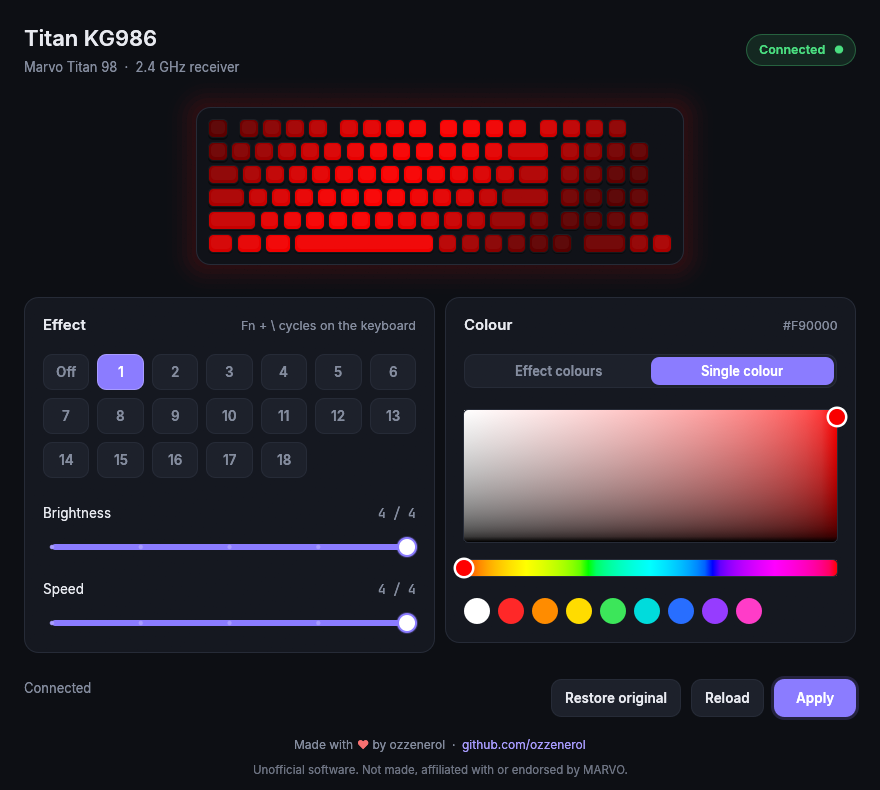
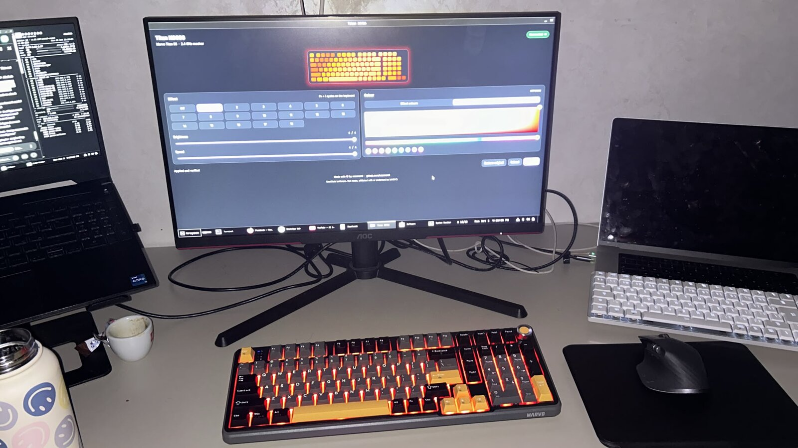
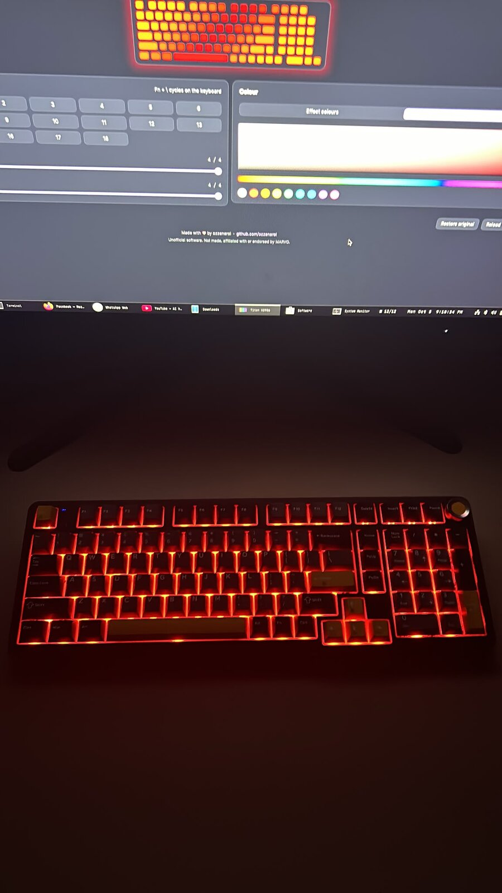
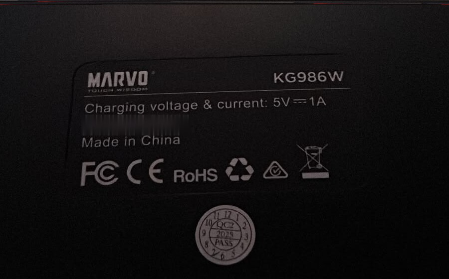

# Titan KG986 for Linux

I bought a MARVO Titan 98 (KG986), plugged the 2.4 GHz dongle into my Debian laptop and went looking for a way to change the lighting. There wasn't one. MARVO only ships a Windows app, and the dongle shows up on Linux as a nameless "CX 2.4G Wireless Receiver". So I made my own.



Here it is running on my desk:



<p>
  
  
</p>

Mine is the KG986W, the wireless one.

It lets you pick an effect, set brightness and speed, switch between the effect's own colours and a single colour of your choice, and put back the settings the keyboard had before you touched anything.

This is not official software. It is not made, affiliated with or endorsed by MARVO.

## Before you use it

- I've only tested it on **Debian 13**, with **my own keyboard**, over the **2.4 GHz dongle**. Other distros should be fine, but I haven't tried them.
- I don't know whether it works on every KG986. Keyboards sold under the same model name can have different firmware. If yours behaves differently, please open an issue.
- Wired and Bluetooth modes are not supported.
- The effects are just numbered because I haven't mapped a name to each one yet.
- If you change brightness with Fn + arrows on the keyboard itself, the app can't see it. The keyboard doesn't report it to the dongle.

The first time it connects, the app saves your keyboard's settings to `~/.local/share/titan-kg986/original.hex`. "Restore original" writes them back.

## Install

### Use the binary

There's a prebuilt x86_64 binary in the root of this repo: `titan-kg986`.

```sh
install -Dm755 titan-kg986 ~/.local/bin/titan-kg986
```

### Or build it yourself

You need Rust (from [rustup.rs](https://rustup.rs)) and a C toolchain:

```sh
sudo apt install build-essential
cargo build --release
install -Dm755 target/release/titan-kg986 ~/.local/bin/titan-kg986
```

### Let your user talk to the dongle

By default only root can access the receiver. This udev rule gives the logged-in user access to this one device and nothing else:

```sh
sudo cp udev/70-titan-kg986.rules /etc/udev/rules.d/
sudo udevadm control --reload-rules
sudo udevadm trigger
```

Then unplug the dongle and plug it back in.

### App menu entry (optional)

```sh
titan-kg986 icon ~/.local/share/icons/hicolor/256x256/apps/titan-kg986.png
cat > ~/.local/share/applications/titan-kg986.desktop <<EOF
[Desktop Entry]
Type=Application
Name=Titan KG986
Exec=$HOME/.local/bin/titan-kg986
Icon=titan-kg986
Categories=Settings;HardwareSettings;
EOF
```

## Command line

Running `titan-kg986` with no arguments opens the app. There are also a few commands:

```
titan-kg986 status [--raw]        show the current effect
titan-kg986 set 1 4 2 single ff0000  effect, brightness 0-4, speed 0-4, colour
titan-kg986 set 3 4 2 colorful    use the effect's own colours
titan-kg986 backup FILE           save the keyboard's settings
titan-kg986 restore FILE          write them back
titan-kg986 watch                 print changes as you use the Fn keys
```

## Thanks

The 2.4 GHz protocol was worked out by the people behind [f75-linux-manager](https://github.com/harshvats17/f75-linux-manager) for the AULA F75, which turned out to use the same receiver. Their code is MIT-licensed, and my Rust port keeps their notice in [NOTICE](NOTICE).

## License

MIT, see [LICENSE](LICENSE). The embedded Inter and JetBrains Mono fonts are under the SIL Open Font License, see `assets/`.

Made with ❤ by [ozzenerol](https://github.com/ozzenerol).
